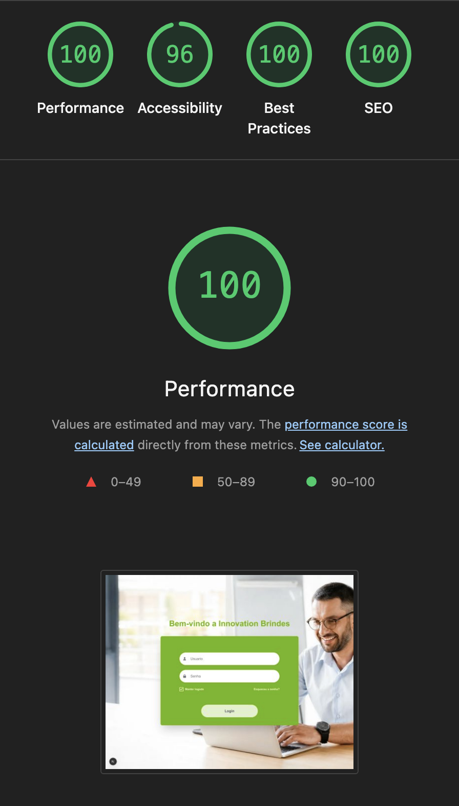
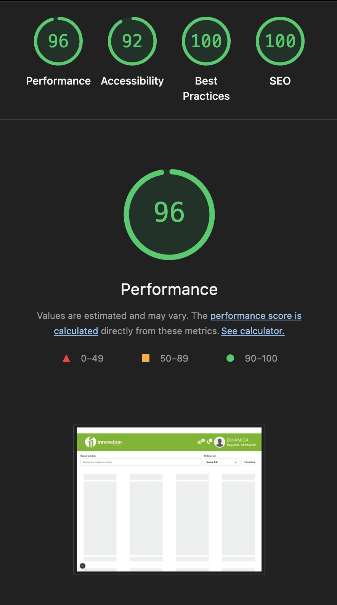

# Innovation Brindes - Front-end Test

Mini application built with Next.js to authenticate users, protect routes, list products, support search, sorting, persistent favorites, incremental loading, and an accessible quick product detail modal.

## Stack

| Technology            | Version | Usage                                                    |
| --------------------- | ------- | -------------------------------------------------------- |
| Next.js               | 16.2.4  | App Router, routes, route handlers, and production build |
| React                 | 19.2.4  | UI                                                       |
| TypeScript            | 5.x     | Static typing                                            |
| Tailwind CSS          | 4.x     | Styling                                                  |
| React Query           | 5.100.7 | Cache, loading/error states, and revalidation            |
| Zustand               | 5.0.12  | Global state and local persistence                       |
| Radix Dialog          | 1.1.15  | Accessible modal                                         |
| Vitest                | 4.1.5   | Unit tests                                               |
| React Testing Library | 16.3.2  | Component tests                                          |
| Playwright            | 1.59.1  | E2E smoke test                                           |
| Docker                | -       | Production container                                     |

## Running Locally

Create a `.env` file:

```env
INNOVATION_API_URL=<api-base-url>
```

Install dependencies and run the project:

```bash
npm install
npm run dev
```

Open:

```txt
http://localhost:3000
```

The `/` route redirects to `/login`.

Test credentials:

```txt
User: dinamica
Password: 123
```

## Docker

Build the image:

```bash
docker build -t innovation-brindes-frontend-test .
```

Run the container:

```bash
docker run --env-file .env -p 3000:3000 innovation-brindes-frontend-test
```

Open:

```txt
http://localhost:3000
```

## Scripts

```bash
npm run dev       # local development
npm run build     # production build
npm run start     # runs the standalone production server
npm run lint      # eslint
npm run test      # unit tests
npm run test:e2e  # Playwright E2E smoke test
```

## Architecture

```txt
.
├── e2e/                         # end-to-end tests
│   └── login-products.spec.ts    # smoke: login -> products
├── public/                       # Next public assets
├── src/
│   ├── app/                      # Next.js App Router
│   │   ├── (private)/            # authenticated route group without changing the URL
│   │   │   ├── layout.tsx        # authenticated layout with header
│   │   │   └── produtos/
│   │   │       └── page.tsx      # /produtos route
│   │   ├── api/                  # internal BFF
│   │   │   ├── auth/             # login/logout
│   │   │   └── products/         # product listing and filters
│   │   ├── login/
│   │   │   └── page.tsx          # /login route
│   │   ├── layout.tsx            # root layout
│   │   ├── not-found.tsx         # 404 page
│   │   ├── page.tsx              # redirect / -> /login
│   │   └── providers.tsx         # React Query provider
│   ├── assets/                   # internal images and icons
│   │   ├── icons/
│   │   └── images/
│   ├── components/               # reusable base components
│   │   ├── Button/               # Button, ButtonLink, and tests
│   │   ├── Card/
│   │   ├── Input/                # Input and tests
│   │   ├── Modal/                # Radix-based modal and tests
│   │   └── Skeleton/
│   ├── constants/                # shared constants
│   ├── hooks/                    # global hooks and React Query hooks
│   ├── services/                 # fetch functions by context
│   ├── stores/                   # Zustand stores
│   ├── test/                     # unit test setup
│   ├── types/                    # shared types
│   ├── utils/                    # global utilities
│   └── views/                    # screen-specific UI and logic
│       ├── login/
│       ├── not-found/
│       └── products/
├── Dockerfile                    # production image
├── playwright.config.ts          # E2E config
└── vitest.config.ts              # unit test config
```

## Technical Decisions

- The access token is stored in an HTTP-only cookie created by the login route handler. The client does not receive or persist the token.
- The `/produtos` route is protected by proxy/middleware and redirects to `/login` when the auth cookie is missing.
- External endpoints are consumed through internal route handlers under `/api`, keeping the API base URL on the server.
- Fetch functions live in `src/services`, React Query hooks in `src/hooks`, and screen-specific logic in `src/views/<view>/hooks`.
- Zustand stores non-sensitive session data and persisted favorites in `localStorage`.
- The modal uses Radix Dialog because it is headless and handles accessibility, focus trap, and Escape key closing behavior.
- The quick product detail modal is loaded with dynamic import for code splitting.
- The chosen pagination strategy is "load more" because it is simple, predictable, and satisfies the requirement to load batches with incremental loading feedback.
- Products without a valid price display "Sob consulta".

## Tests

Unit tests:

```bash
npm run test
```

Covered components:

- `Button`
- `Input`
- `Modal`

E2E smoke test:

```bash
npm run test:e2e
```

The smoke test validates:

- login
- mocked session cookie
- redirect to `/produtos`
- user name in the header
- current date in the header
- rendered product grid

Login and product responses are mocked in Playwright to avoid depending on the external API during tests.

## Demo

[View login to products flow](docs/images/login-to-products-flow.mp4)

## Lighthouse

Desktop audits executed on the main routes:

| Route       | Performance | Accessibility | Best Practices | SEO |
| ----------- | ----------: | ------------: | -------------: | --: |
| `/login`    |         100 |            96 |            100 | 100 |
| `/produtos` |          96 |            92 |            100 | 100 |

### Evidence

**/login**



**/produtos**



Base command used:

```bash
npx lighthouse http://localhost:3000/login --preset=desktop --only-categories=performance,accessibility --chrome-flags="--headless"
```

## Checklist

- [x] Login with user, password, keep me logged in, and recovery link
- [x] Authentication via POST
- [x] Token stored in HTTP-only cookie
- [x] `/produtos` route protection
- [x] Listing via GET with Bearer token on the server
- [x] Debounced search using POST with filters
- [x] Empty state
- [x] Incremental loading
- [x] Local sorting by name and price
- [x] Accessible quick detail modal
- [x] Persisted favorites
- [x] Skeleton/loading states
- [x] Error handling and retry/backoff
- [x] Automatic logout on 401
- [x] BRL price formatting
- [x] Mobile-first layout
- [x] Basic SEO
- [x] Code splitting
- [x] Docker
- [x] Unit tests
- [x] E2E smoke test
- [x] Lighthouse desktop above 90
